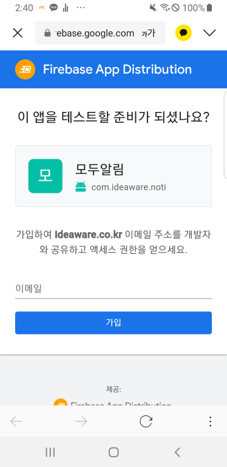
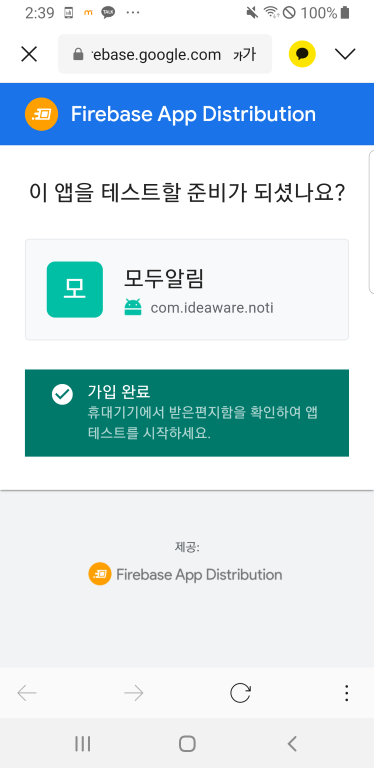
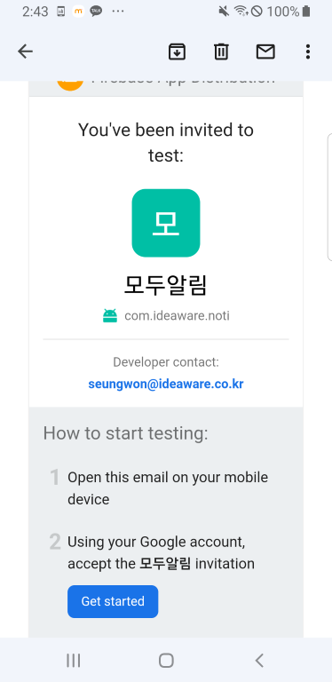
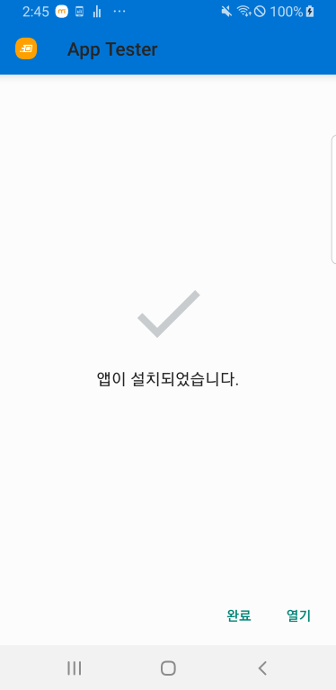
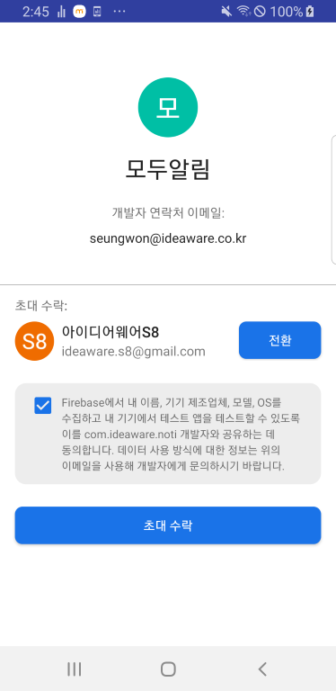
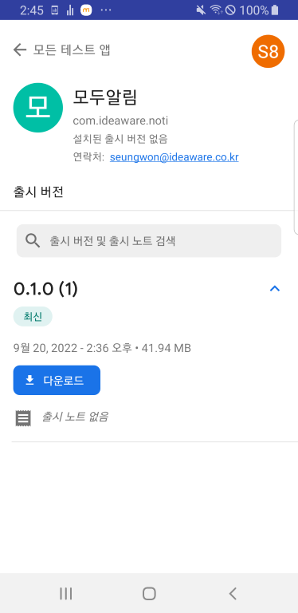

testApp 배포 관련
다운로드 방법

링크 : https://appdistribution.firebase.dev/i/cabe96caace5d7d7

1. AOS 휴대전화로 링크를 클릭하여 회사 이메일 (@ideaware.co.kr)도메인으로 가입

2. Get started 버튼을 눌러 App Tester 앱 다운 및 설치 (플레이스토어가 아닌 외부에서 설치 경고가 뜰 수도 있습니다.)

3. App Tester 앱을 켜서 초대 수락

4. 다운로드 (업데이트 시에는 업데이트) 를 눌러 모두알림 앱 다운 및 설치 (플레이스토어가 아닌 외부에서 설치 경고가 뜰 수도 있습니다.)
