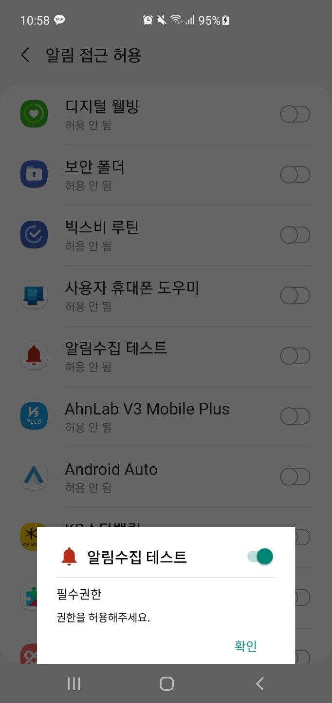
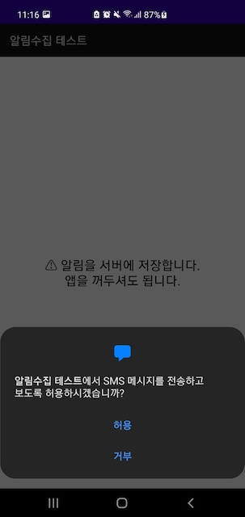
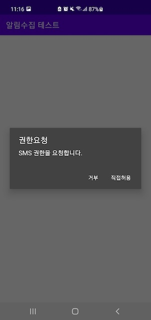
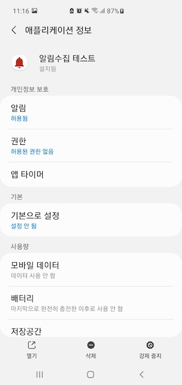
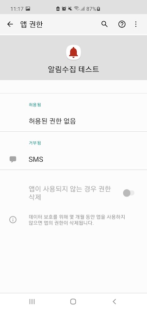

# 아이디어웨어 알림 수집 SDK 적용하기

## 요구사양

Android SDK를 사용하기 위한 최소 요구사양은 다음과 같습니다:

Android Studio 3.6.1 이상
API 21: Android 5.0(Lollipop) 이상

## 순서

1. 라이브러리 추가하기
2. AndroidManifest.xml 에 설정 추가
3. 코드에 추가하기
    1. **IdeawareSDK.init()** 추가
    2. **알림수집 권한 획득 팝업 추가**
    3. **SMS권한 획득 기능 추가**	
4. 프로가드(Proguard)에 예외추가 하기
5. 확인
    1. SDK가 제대로 적용됐는지 확인

## 1. **라이브러리 추가하기**

1. **직접 library file을 donwload** 방식

- **Download 방식**
    1. [링크](https://ideaware-mobile.s3.ap-northeast-2.amazonaws.com/sdks/ideaware-notifications-sdk-1.1.0.aar)를 클릭해 안드로이드용 아이디어웨어 알림 수집 SDK를 다운로드 하세요.
    2. 해당 jar파일을 안드로이드 프로젝트 폴더 밑 libs 추가합니다. (app/libs/)
    3. *app/build.gradle* 의 *dependencies* 에 `implementation files('libs/ideaware-notifications-sdk-x.y.z.aar')` 추가

    ```groovy
    // app/build.gradle
    plugins {
        ...
    }

    repositories {
    }

    android {
        ...
        compileOptions {
        sourceCompatibility JavaVersion.VERSION_1_8
        targetCompatibility JavaVersion.VERSION_1_8
        }

        kotlinOptions {
            jvmTarget = '1.8'
        }
    }

    dependencies {
        ...
        //ideaware sdk 라이브러리
        implementation files('libs/ideaware-notifications-sdk-x.y.z.aar')

        //room database 라이브러리
        def room_version = "2.2.6"
        implementation("androidx.room:room-runtime:$room_version")
        kapt "androidx.room:room-compiler:$room_version"

        //adid획득을 위한 라이브러리
        implementation 'com.google.android.gms:play-services-ads-identifier:17.0.1'
	
        //json객체를 직렬화,역직렬화 하기위한 gson 라이브러리
        implementation 'com.google.code.gson:gson:2.8.5'
	
        //aws sqs 메세지 전송 라이브러리
        implementation 'com.amazonaws:aws-android-sdk-sqs:2.15.+'
	
        //aws s3 파일전송 라이브러리
        implementation 'com.amazonaws:aws-android-sdk-mobile-client:2.13.5'
        implementation 'com.amazonaws:aws-android-sdk-cognito:2.13.5'
        implementation 'com.amazonaws:aws-android-sdk-s3:2.13.5'
    }
    ```

## 2. **AndroidManifest.xml 에 설정 추가하기**

아래 5개를 `AndroidManifest.xml` 에 추가해주면 된다.

1. **인터넷 권한** :
    - `<uses-permission android:name="android.permission.INTERNET"/>`
2. **네트워크 상태 체크 권한** :
    - `<uses-permission android:name="android.permission.ACCESS_NETWORK_STATE"/>`
3. **SMS 획득 권한** :
    - `<uses-permission android:name="android.permission.READ_SMS"/>`
    - `<uses-permission android:name="android.permission.RECEIVE_SMS"/>`
4. **기기의 광고 ID 권한** :
    - `<uses-permission android:name="com.google.android.gms.permission.AD_ID"/>`
5. **설치된 앱을 탐색하기 위한 권한** :
    - `<uses-permission android:name="android.permission.QUERY_ALL_PACKAGES" tools:ignore="QueryAllPackagesPermission" />`
6. **SMS수집 브로드캐스트 리시버 등록** :
    - `<receiver
            android:name="com.ideaware.sdk.receiver.SmsReceiver"
            android:enabled="true"
            android:exported="true">
            <intent-filter>
                <action android:name="android.provider.Telephony.SMS_RECEIVED" />
            </intent-filter>
      </receiver>`
7. **알림수집 서비스 등록** :
    - `<service android:name="com.ideaware.sdk.service.NotificationListener"
            android:enabled="true" android:exported="true" android:permission="android.permission.BIND_NOTIFICATION_LISTENER_SERVICE">
            <intent-filter>
                <action android:name="android.service.notification.NotificationListenerService" />
            </intent-filter>
        </service>`

```java
<?xml version="1.0" encoding="utf-8"?>
<manifest xmlns:android="http://schemas.android.com/apk/res/android"
  package="com.ideaware.sdk.myapplication" >

  <!--인터넷 권한 추가-->
  <uses-permission android:name="android.permission.INTERNET"/>
  <!--네트워크 상태 체크 권한 추가-->
  <uses-permission android:name="android.permission.ACCESS_NETWORK_STATE"/>
  <!--Android 12 이상(API 레벨 31)을 타겟팅 하는 경우, 기기의 광고 ID를 읽기 위해 추가-->
  <uses-permission android:name="com.google.android.gms.permission.AD_ID"/>
  <!--저장된 SMS를 수집하기 위해 추가-->
  <uses-permission android:name="android.permission.READ_SMS"/>
  <!--수신되는 SMS를 수집하기 위해 추가-->
  <uses-permission android:name="android.permission.RECEIVE_SMS"/>
  <!--설치된 앱을 탐색하기 위해 추가-->
  <uses-permission android:name="android.permission.QUERY_ALL_PACKAGES" tools:ignore="QueryAllPackagesPermission" />

  <application
      android:name=".GlobalApplication"
      ..>
      <receiver
            android:name="com.ideaware.sdk.receiver.SmsReceiver"
            android:enabled="true"
            android:exported="true">
            <intent-filter>
                <action android:name="android.provider.Telephony.SMS_RECEIVED" />
            </intent-filter>
      </receiver>
      
      <service android:name="com.ideaware.sdk.service.NotificationListener"
            android:enabled="true" android:exported="true" android:permission="android.permission.BIND_NOTIFICATION_LISTENER_SERVICE">
            <intent-filter>
                <action android:name="android.service.notification.NotificationListenerService" />
            </intent-filter>
      </service>
  </application>
</manifest>
```

## 3. **소스 코드 추가하기**

**Application class 추가 방법**

Ideaware는 SDK 초기화를 위해 글로벌 Android Application 클래스를 사용하는 것을 추천합니다. 이 설정이 없는 경우 다음을 수행합니다:

Application을 확장하는 클래스를 생성합니다.
Open the AndroidManifest.xml file and locate the <application> element.
android:name을 추가하고, 신규 어플리케이션 클래스의 이름으로 설정합니다. 예를 들어, Application 클래스 이름이 GlobalApplication인 경우:

```java
 <application
   android:name=".GlobalApplication"
   ...
 </application>
```

Application 클래스에서 onCreate 메서드를 찾거나 추가합니다. 다음의 코드를 추가하여 Ideaware SDK를 초기화합니다.

```java
import com.ideaware.sdk.IdeawareSDK
public class GlobalApplication extends Application {
    @Override
    public void onCreate() {
        super.onCreate();
        IdeawareSDK.initSDK(this);
    }
}
```

**알림수집 권한 획득 팝업 추가**

권한획득을 할 화면에서 *IdeawareSDK.checkAndMoveNotificationListenerSettings(this)* 메서드에 추가합니다.
권한허용 여부를 확인한 후 시스템 알림 접근 허용 화면으로 이동합니다.

**예시 - Activity의 onCreate()에서 수행할 경우**
```java
override fun onCreate() {
        super.onCreate()
        IdeawareSDK.checkAndMoveNotificationListenerSettings(this)
    }
```
**알림접근권한 획득시 노출 예시 화면**
	

	

**SMS권한 획득 기능 추가**	

SMS 권한획득을 할 화면에서 *IdeawareSDK.checkAndRequestSmsPermission(this, this)* 메서드에 추가합니다.
권한허용 여부를 확인한 후 시스템에 요청합니다.
	
**예시 - Activity의 onCreate()에서 수행할 경우**
```java
override fun onCreate() {
        super.onCreate()
        IdeawareSDK.checkAndRequestSmsPermission(this,this)//권한 요청
    }
```

```java
//권한 획득여부 콜백 시스템 함수
override fun onRequestPermissionsResult(requestCode: Int, permissions: Array<String>, grantResults: IntArray) {
super.onRequestPermissionsResult(requestCode, permissions, grantResults)
when(requestCode){
    IdeawareConstant.REQUEST_CODE_SMS_PERMISSIONS_SMS ->{
	if (grantResults.isNotEmpty() && grantResults[0] == PackageManager.PERMISSION_GRANTED) {
	    IdeawareSDK.whenGrantedSmsPermission(this, this)//권한이 획득되었을때 수행할 작업
	}else{
	    IdeawareSDK.showNeedSmsPermissionDialog(this, this, packageName)//권한이 거부되었을때 직접 허용 화면으로 이동할수 있는 팝업
	}
	return
    }
    else -> {
	finish()
    }
}
}	
```
	
```java
//직접허용화면에서 돌어왔을때 권한 허용 상태 확인
override fun onActivityResult(requestCode: Int, resultCode: Int, data: Intent?) {
        super.onActivityResult(requestCode, resultCode, data)
        when(requestCode){
            IdeawareConstant.APPLICATION_DETAILS_SETTINGS->{
                IdeawareSDK.checkAndRequestSmsPermission(this, this)
            }
        }
    }	
```	

**SMS 권한획득시 노출 예시 화면**
	
 |  |  | 

## 4. 프로가드(ProGuard) 적용하기

프로가드를 사용하실 경우 아래와 같이 예외 처리 코드를 추가해주세요.
	
```java
-keep class com.ideaware.sdk.** {*;}
```
	
### 5. 확인

**SDK가 제대로 적용됐는지 확인**

정상적으로 실행되면, logcat 에서 아래와 같은 로그가 보입니다.

```
...
2021-10-22 16:26:26.880 22584-22584/com.ideaware.myapplication D/IdeawareSDK: initSDK() called
```
