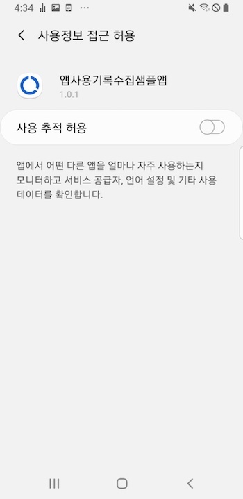
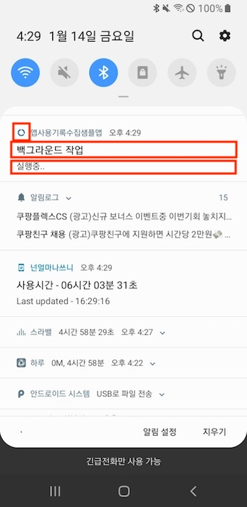

# 아이디어웨어 앱 사용기록 수집 SDK 적용하기

## 요구사양

Android SDK를 사용하기 위한 최소 요구사양은 다음과 같습니다:

Android Studio,
API 23: Android 6.0(M) 이상

## 순서

1. 라이브러리 추가하기
2. AndroidManifest.xml 에 설정 추가
3. 코드에 추가하기
    1. **IdeawareSDK.init()** (필수)
    2. **사용정보 접근 허용 권한 획득** (필수)
    3. **알람매니저 시간 재설정 코드** (필수)
    4. **사용자 성별, 생년 정보 전달** (옵션)
    5. **알림 문구 및 아이콘리소스 전달** (옵션)
4. 프로가드(Proguard)에 예외추가 하기
5. 확인
    1. SDK가 제대로 적용됐는지 확인

## 1. **라이브러리 추가하기**

1. **직접 library file을 donwload** 방식

- **Download 방식**
    1. [링크](https://ideaware-mobile.s3.ap-northeast-2.amazonaws.com/sdks/ideaware-usage-sdk-1.0.6.aar)를 클릭해 안드로이드용 아이디어웨어 앱사용기록 수집 SDK를 다운로드 하세요.
    2. 해당 jar파일을 안드로이드 프로젝트 폴더 밑 libs 추가합니다. (app/libs/)
    3. *app/build.gradle* 의 *dependencies* 에 `implementation files('libs/ideaware-usage-sdk-x.y.z.aar')` 추가

    ```groovy
    // app/build.gradle
    plugins {
        ...
    }

    repositories {
    }

    android {
        ...
	 defaultConfig {
	   ...
           targetSdk 31
        }
	
        compileOptions {
        sourceCompatibility JavaVersion.VERSION_1_8
        targetCompatibility JavaVersion.VERSION_1_8
        }

        kotlinOptions {
            jvmTarget = '1.8'
        }
    }

    dependencies {
        ...
        //ideaware sdk 라이브러리
        implementation files('libs/ideaware-usage-sdk-x.y.z.aar')
    }
    ```
    4. ideaware 앱사용기록 수집 SDK에서 사용하는 라이브러리는 다음과 같습니다
    ```groovy
    implementation 'androidx.room:room-runtime:2.3.0'
    implementation 'androidx.room:room-ktx:2.3.0'
    implementation ('com.amazonaws:aws-android-sdk-mobile-client:2.15.+@aar') { transitive = true }
    implementation 'com.google.code.gson:gson:2.8.5'
    implementation 'com.google.android.gms:play-services-ads-identifier:17.0.1'
    implementation 'com.amazonaws:aws-android-sdk-mobile-client:2.13.5'
    implementation 'com.amazonaws:aws-android-sdk-cognito:2.13.5'
    implementation 'com.amazonaws:aws-android-sdk-s3:2.13.5'
    implementation 'androidx.work:work-runtime-ktx:2.7.1'
    implementation 'com.google.firebase:firebase-analytics-ktx:26.2.0'
    ```
    5. AndroidX 사용하는 경우
    ```groovy
    gradle.properties ::
    * android.useAndroidX=true
    * android.enableJetifier=true
    ```

## 2. **AndroidManifest.xml 에 설정 추가하기**

아래 권한을 `AndroidManifest.xml` 에 추가

1. **인터넷 권한** :
    - `<uses-permission android:name="android.permission.INTERNET"/>`
2. **포그라운드 서비스 실행 권한** :
    - `<uses-permission android:name="android.permission.FOREGROUND_SERVICE" />`
3. **와이파이 관련정보 접근** :
    - `<uses-permission android:name="android.permission.ACCESS_WIFI_STATE" />`
4. **네트워크 상태 체크 권한** :
    - `<uses-permission android:name="android.permission.ACCESS_NETWORK_STATE" />`
5. **기기의 광고 ID 권한** :
    - `<uses-permission android:name="com.google.android.gms.permission.AD_ID"/>`
6. **사용정보접근허용 접근 권한** :
    - `<uses-permission
        android:name="android.permission.PACKAGE_USAGE_STATS"
        tools:ignore="ProtectedPermissions" />`
7. **네트워크사용량 접근 권한** :
    - `<uses-permission
        android:name="android.permission.READ_NETWORK_USAGE_HISTORY"
        tools:ignore="ProtectedPermissions" />`
8. **안드로이드11(api level 30)부터 패키지검색제한** :
    - `<uses-permission
        android:name="android.permission.QUERY_ALL_PACKAGES"
        tools:ignore="QueryAllPackagesPermission" />`	
9. **핸드폰 재부팅 인텐트 수신** :
    - `<uses-permission android:name="android.permission.RECEIVE_BOOT_COMPLETED" />`

```java
<?xml version="1.0" encoding="utf-8"?>
<manifest xmlns:android="http://schemas.android.com/apk/res/android"
  package="com.ideaware.appusagesdksample" >

    <!--인터넷사용권한-->
    <uses-permission android:name="android.permission.INTERNET" />
    <!--포그라운드 서비스 실행 권한-->
    <uses-permission android:name="android.permission.FOREGROUND_SERVICE" />
    <!--와이파이 관련정보 접근-->
    <uses-permission android:name="android.permission.ACCESS_WIFI_STATE" />
    <!--네트워크 상태 체크 권한-->
    <uses-permission android:name="android.permission.ACCESS_NETWORK_STATE" />
    <!--기기의 광고 ID 권한-->
    <uses-permission android:name="com.google.android.gms.permission.AD_ID"/>
    <!--사용정보접근허용 접근 권한-->
    <uses-permission
        android:name="android.permission.PACKAGE_USAGE_STATS"
        tools:ignore="ProtectedPermissions" />
    <!--네트워크사용량 접근 권한-->
    <uses-permission
        android:name="android.permission.READ_NETWORK_USAGE_HISTORY"
        tools:ignore="ProtectedPermissions" />
    <!--안드로이드11(api level 30)부터 패키지검색제한-->
    <uses-permission
        android:name="android.permission.QUERY_ALL_PACKAGES"
        tools:ignore="QueryAllPackagesPermission" />
    <!--핸드폰 재부팅 인텐트 수신-->
    <uses-permission android:name="android.permission.RECEIVE_BOOT_COMPLETED" />

  <application
      android:name=".GlobalApplication"
      ..>

  </application>
</manifest>
```

## 3. **소스 코드 추가하기**

**Application class 추가 방법**

Ideaware는 SDK 초기화를 위해 글로벌 Android Application 클래스를 사용하는 것을 추천합니다. 이 설정이 없는 경우 다음을 수행합니다:

Application을 확장하는 클래스를 생성합니다.
Open the AndroidManifest.xml file and locate the <application> element.
android:name을 추가하고, 신규 어플리케이션 클래스의 이름으로 설정합니다. 예를 들어, Application 클래스 이름이 GlobalApplication인 경우:

```java
 <application
   android:name=".GlobalApplication"
   ...
 </application>
```

Application 클래스에서 onCreate 메서드를 찾거나 추가합니다. 다음의 코드를 추가하여 Ideaware SDK를 초기화합니다.

```java
import com.ideaware.sdk.IdeawareSDK
public class GlobalApplication extends Application {
    @Override
    public void onCreate() {
        super.onCreate();
        IdeawareUsageSDK.initSDK(this);
    }
}
```


**사용정보 접근 허용 권한 획득**

권한획득을 할 화면에서 *IdeawareSDK.isUsageStatsPermissionEnable(this)* 와 *IdeawareUsageSDK.requestUsageStatsPermission(this)*메서드를 추가합니다.
권한허용 여부를 확인한 후 시스템 사용정보 접근 허용 화면으로 이동합니다.

**예시 - Activity의 onCreate()에서 수행할 경우**
```java
import com.ideaware.sdk.usage.IdeawareUsageSDK

override fun onCreate() {
        super.onCreate()
        if(!IdeawareUsageSDK.isUsageStatsPermissionEnable(this)){//사용정보 접근 권한 허용이 되어있지 않다면
            IdeawareUsageSDK.requestUsageStatsPermission(this)//권한을 허용할 수 있는 화면으로 이동
        }
    }
```
**사용정보 접근 권한 획득시 노출 예시 화면**

 |  	


**알람매니저 동작**

SDK의 알람매니저를 동작시키기위해 앱 실행시 동작하는 액티비티 onCreate() 에서 *IdeawareUsageSDK.refreshAlarmTrigger(this)* 메서드를 추가합니다. 
앱을 재 실행해도 이미 설정된 알람이 있을 경우에는 알람매니저랑 재 설정 하지 않습니다.

**예시 - Activity의 onCreate()에서 수행할 경우**
```java
import com.ideaware.sdk.usage.IdeawareUsageSDK

override fun onCreate() {
        super.onCreate()
	IdeawareUsageSDK.refreshAlarmTrigger(this)//알람매니저 시간을 재설정
    }
```
	

**사용자 성별, 생년 정보 전달**	

앱에서 사용자의 성별, 또는 생년 정보를 보유하고 있다면 전달이 가능합니다.
```java
import com.ideaware.sdk.usage.IdeawareUsageSDK

override fun onCreate() {
	super.onCreate()

	//성별
	IdeawareUsageSDK.setUserGenderType(this, GenderType.MALE.name)//남성일 경우
	IdeawareUsageSDK.setUserGenderType(this, GenderType.FEMAIL.name)//여성일 경우
	IdeawareUsageSDK.setUserGenderType(this, "")//없을 경우, 해당코드를 작성하지 않아도 없음으로 판단

	//생년
	IdeawareUsageSDK.setUserBirth(this, "yyyy-MM-dd")//형식 동일하게 필수
    }
```


**알림 문구 및 아이콘리소스 전달**

앱 사용기록 수집 SDK가 동작시 포그라운드서비스를 동작하기 위해 노출되는 알림의 문구와 아이콘을 설정할 수 있습니다.
별도 설정이 없을 시 기본 문구 및 아이콘으로 설정됩니다.
```java
import com.ideaware.sdk.usage.IdeawareUsageSDK

override fun onCreate() {
	super.onCreate()
	IdeawareUsageSDK.setNotificationTitle(this, "알림의 제목을 입력해주세요.")//알림 제목 설정
        IdeawareUsageSDK.setNotificationContent(this, "알림의 내용을 입력해주세요.")//알림 내용 설정
        IdeawareUsageSDK.setNotificationIconResource(this, R.drawable.ic_notification_icon)//알림 아이콘 설정

    }
```

**알림이 동작할때 화면 예시 화면**
	



## 4. 프로가드(ProGuard) 적용하기

프로가드를 사용하실 경우 아래와 같이 예외 처리 코드를 추가해주세요.
	
```java
-keep class com.ideaware.sdk.usage.** {*;}
```
	
### 5. 확인

**SDK가 제대로 적용됐는지 확인**

정상적으로 실행되면, logcat 에서 아래와 같은 로그가 보입니다.

```
...
2022-01-17 16:26:26.880 22584-22584/com.ideaware.appusagesdksample D/IdeawareSDK: initSDK() called
```
