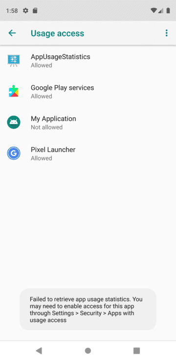
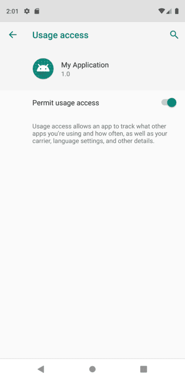

# 아이디어웨어 앱사용 기록 수집 SDK 구현 계획

## 요구 환경

앱사용기록 수집 Android SDK를 사용하기 위한 요구 환경은 다음과 같습니다:

Android Studio,
API 23: Android 6.0(M) 이상

## 순서

1. 수집 항목 및 권한획득
	1. **설치앱 목록**
    2. **앱사용 히스토리**
    3. **앱 별 데이터 사용량**
    4. **패널 정보**
    5. **광고 아이디**
    6. **기본앱 설정 패키지**

2. 안드로이드 서비스 활용 계획
	1. **후후의 서비스를 활용하는 경우**
    2. **SDK내부구현 서비스를 활용하는 경우**

3. 수집 주기 및 앱 내부 저장
    1. **1시간단위로 수집**
    2. **Room 데이터베이스에 저장**

4. 서버 업로드

5. 배포 계획
    1. **다운로드 링크를 통한 aar파일 다운로드**

## 1. **수집 항목 및 권한 획득**

1. **설치 앱 목록**
- **Android11이상 필요권한**
  `<uses-permission android:name="android.permission.QUERY_ALL_PACKAGES"/>`
- 패키지 이름
- 앱이름

2. **앱사용 히스토리**
- **UsageStatsManager를 사용(API 21 이상)**
  `<uses-permission android:name="android.permission.PACKAGE_USAGE_STATS" tools:ignore="ProtectedPermissions" />`
  
- 권한이 없다면 `Settings.ACTION_USAGE_ACCESS_SETTINGS` 사용정보 접근 허용 시스템 화면으로 이동

- **UsageStats(시작시간, 종료시간으로 조회)**
    1. 패키지 이름`.getPackageName()`
    2. 마지막으로 사용된 시간`.getLastTimeUsed()`
    3. 총 실행 시간`.getTotalTimeInForeground()`
    4. 실행된 횟수`.getTotalTimeInForeground()`

- **UsageEvents(시작시간, 종료시간으로 조회)**
    1. 패키지 이름`.getPackageName()`
    2. 클래스 이름`.getClassName()`
    3. 이벤트 발생 시간`.getTimeStamp()`
    4. 이벤트 타입`.getEventType()`

- **ConfigurationStats(시작시간, 종료시간으로 조회)**
    1. 기기의 활성화 횟수`.getActivationCount()`
    2. 기기의 마지막 활성화 시간`.getLastTimeActive()`
    3. 기기의 총 활성화 시간`.getTotalTimeActive()`

3. **앱 데이터 사용량**
    - **NetworkStatsManager를 사용(API 23 이상)**
    - `<uses-permission android:name="android.permission.READ_PHONE_STATE"/>`
    - `<uses-permission android:name="android.permission.PACKAGE_USAGE_STATS"
            tools:ignore="ProtectedPermissions" />`
    - 모바일데이터 사용량(송수신의 합)
    - 와이파이데이터 사용량(송수신의 합)

4. **패널 정보**
    - 패널아이디(SSAID), 예시)0d19f46d9720263c
    - 모델명, 예시)SM-G950N
    - OS버전, 예시)10
    - 앱버전, 예시)1.0.0
    - 통신사, 예시)KOR SK Telecom
    - 제조사, 예시)samsung
    - 언어정보, 예시)KR
    - 홈 런처 패키지이름 예시)com.sec.android.app.launcher
    - 유심 국가 정보 예시)kr

5. **광고아이디**
    - Android 12 이상(API 레벨 31)을 타겟팅 하는 경우, 기기의 광고 ID를 읽기 위해 추가
    - `<uses-permission android:name="com.google.android.gms.permission.AD_ID"/>`

6. **기본앱 설정 패키지**
    - 기본앱 설정 패키지 이름(전화앱, 문자앱, 브라우저앱)

## 2. **안드로이드 서비스 활용 계획**
- **후후의 서비스를 활용하는 경우**	
    - 서비스에서 직접 SDK내부 수집함수를 호출

- **SDK내부구현 서비스를 활용하는 경우**	
    1. AndroidManifest.xml에 서비스 등록 필요
    2. SDK내부 정의된 서비스를 실행하는 함수호출
    3. 노티피케이션 알림을 띄우거나 후후의 알림아이디로 전달받아 단일알림을 유지

## 3. **수집 주기 및 저장**
- **1시간 단위로 수집**	
    1. 서비스에서 시간단위를 체크
    2. 1시간 단위로 데이터 수집 
- **Room 데이터베이스에 저장 및 삭제**	
    1. 주기단위로 수집된 데이터를 저장
    2. 자정기준 서버 업로드 이후에 삭제

## 4. **서버 업로드**
- **수집된 데이터 1일 1회 업로드**	
    1. 자정을 기준으로 전날 수집된 데이터를 암호화 한뒤 압축하여 하여 서버로 업로드 합니다.

## 5. **배포 계획**
- **Download 방식**
    1. [링크](https://ideaware-mobile.s3.ap-northeast-2.amazonaws.com/sdks/sdk-1.0.0.aar)를 클릭해 안드로이드용 아이디어웨어 SDK를 다운로드 하세요.
    2. 해당 jar파일을 안드로이드 프로젝트 폴더 밑 libs 추가합니다. (app/libs/)
    3. *app/build.gradle* 의 *dependencies* 에 `implementation files('libs/sdk-x.y.z.aar')` 추가
